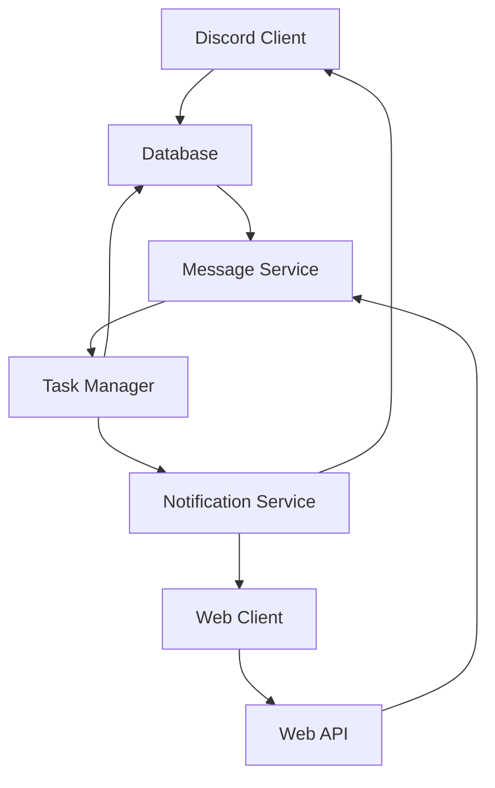
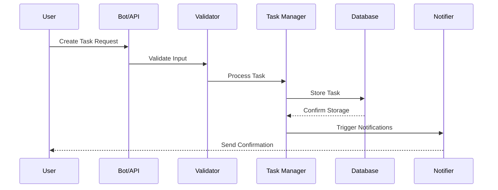
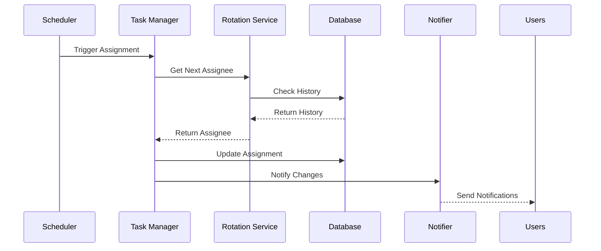

# System Patterns

## System Architecture

### High-Level Overview



## Core Components

### 1. Discord Bot
- **Pattern**: Event-Driven Architecture
- **Responsibility**: Handles Discord interactions and commands
- **Key Features**:
  - Command parsing and validation
  - Event handling
  - Real-time user interactions
  - Permission management with role hierarchy
  - Two-way Discord role sync
  - Automatic state reconciliation
  - Role cleanup and recovery
  - Performance monitoring
  - Cache invalidation
  - Role assignment tracking

### 2. Web Dashboard
- **Pattern**: MVC (Model-View-Controller)
- **Responsibility**: Provides visual interface for management
- **Key Features**:
  - Responsive design
  - Real-time updates
  - Role-based access control
  - Interactive task management

### 3. Task Manager
- **Pattern**: Domain-Driven Design
- **Responsibility**: Core business logic for task management
- **Key Features**:
  - Task creation and assignment
  - Schedule management
  - Rotation algorithms
  - Status tracking

### 4. Database Layer
- **Pattern**: Repository Pattern
- **Technology**: MongoDB
- **Key Features**:
  - Type-safe operations
  - Optimized queries
  - Data validation
  - Transaction management

## Command System Pattern

### Structure Overview
```
commands/
└── commandName/
    ├── index.ts         # Command registration and execution
    ├── types.ts         # Command-specific types
    ├── utils.ts         # Shared utilities
    └── handlers/        # Command handlers
        ├── index.ts     # Handler registration
        └── ...Handler.ts # Individual handlers
```

### Key Components

1. **index.ts**
```typescript
export const commandName: Command = {
    data: new SlashCommandBuilder()
        .setName('commandName')
        .setDescription('Command description')
        .addSubcommand(...),
    
    async execute(interaction) {
        await interaction.deferReply();
        const subcommand = interaction.options.getSubcommand();
        const handler = handlers[subcommand];
        await handler.execute(interaction);
    }
};
```

2. **types.ts**
```typescript
export interface CommandHandler {
    execute(interaction: ChatInputCommandInteraction): Promise<void>;
}

export interface Handlers {
    [subcommand: string]: CommandHandler;
}
```

3. **utils.ts**
```typescript
export function formatError(error: Error): string {
    return `❌ Error: ${error.message}`;
}

export function formatSuccess(message: string): string {
    return `✅ ${message}`;
}
```

### Best Practices

1. **Error Handling**
   - Use try-catch in command execution
   - Format errors consistently
   - Provide user-friendly error messages

2. **Type Safety**
   - Define interfaces for all data structures
   - Use typed handlers for each subcommand
   - Leverage TypeScript's type system

3. **Command Registration**
   - Export commands as named exports
   - Use consistent command structure
   - Validate command registration

4. **Handler Pattern**
   - One handler class per subcommand
   - Implement common handler interface
   - Centralize handler registration

5. **Utilities**
   - Share common functionality in utils
   - Use consistent formatting
   - Keep utilities command-specific

## Data Flow

### Task Creation Flow


### Task Assignment Flow


## Security Patterns

### 1. Authentication
- JWT-based authentication
- Role-based access control
- Session management
- Secure password handling

### 2. Data Protection
- Input validation
- Output sanitization
- Rate limiting
- Error handling

## Error Handling

### 1. Global Error Pattern
- Consistent error structure
- Error logging
- User-friendly messages
- Recovery mechanisms

### 2. Validation Pattern
- Type-safe input validation
- Business rule validation
- Data consistency checks
- Cross-field validation

## Testing Patterns

### 1. Unit Testing
- Component isolation
- Mocked dependencies
- Comprehensive coverage
- Automated testing

### 2. Integration Testing
- API endpoint testing
- Database operations
- Command processing
- Event handling

## Optimization Patterns

### 1. Caching Strategy
- Frequently accessed data
- User permissions
- Task templates
- Configuration settings

### 2. Query Optimization
- Indexed fields
- Aggregation pipelines
- Batch operations
- Connection pooling
